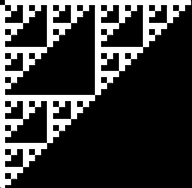

# Test script
```
./test.sh
```
This will assemble test programs and compare to reference binaries.

`sierp0` - a very short program generating the following pattern in the screen buffer region (0x200 - 0x600). Tests multiple addressing modes and labels.



`sierp1` - a slightly more involved version - this one uses forward label referencing and requires more gymnastics.


source: http://www.6502asm.com/

```
sierp0 TEST PASSED
sierp1 TEST PASSED
```

# hexwrite.c
Use to make bin files from hex

```
gcc -c hexwrite.c -o hexwrite
```

example:

```
% gcc hexwrite.c -o hexwrite
% ./hexwrite a.ref a9 01 8d 00 02 a9 05 8d 01 02 a9 08 8d 02 02
wrote 15 bytes to a.ref
% xxd a.ref
00000000: a901 8d00 02a9 058d 0102 a908 8d02 02    ...............
```
